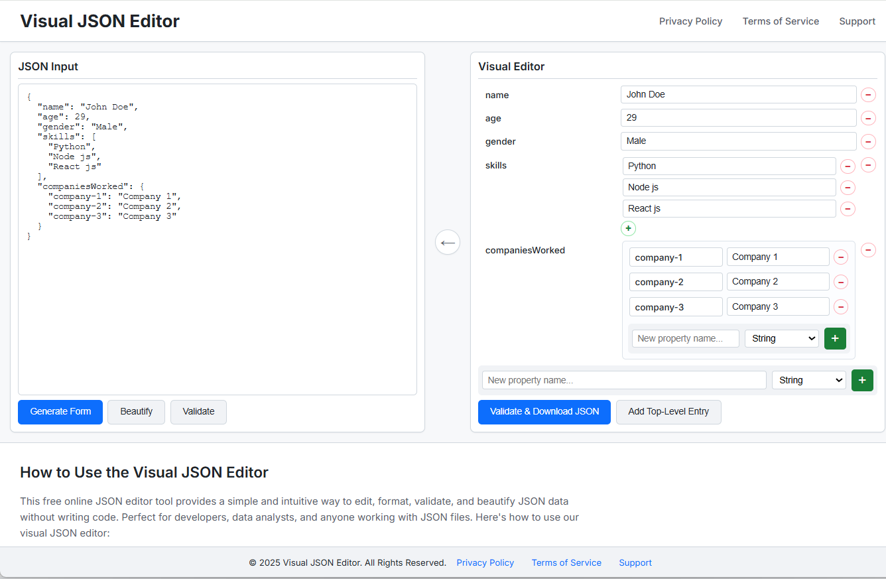

# Visual JSON Editor

A free, privacy-focused web application for editing JSON data visually without writing code. All processing happens client-side in your browser.



## Features

- **Visual Form Generation** - Converts JSON into interactive form fields
- **Bidirectional Sync** - Update JSON from visual editor and vice versa
- **Type Support** - Handles strings, numbers, booleans, objects, arrays, and null
- **Dynamic Management** - Add/remove object properties and array items
- **JSON Validation** - Validates syntax before processing
- **Auto-formatting** - Beautify JSON with proper indentation
- **Download** - Export edited JSON as a file
- **100% Client-Side** - Your data never leaves your browser

## Quick Start

```bash
# Clone the repository
git clone https://github.com/yennares/visual-json-editor.git
cd visual-json-editor

# Install dependencies
npm install

# Start development server
npm run dev
```

Open `http://localhost:3000` in your browser.

## Usage

1. Paste JSON into the left panel
2. Click "Generate Form" to create visual editor
3. Edit values, add/remove properties
4. Click arrow button (←) to sync changes back to JSON
5. Download your edited JSON file

## Tech Stack

- **Vite 6.2.0** - Build tool & dev server
- **TypeScript 5.8.2** - Type-safe JavaScript
- **Vanilla JS** - No framework overhead
- **HTML5/CSS3** - Modern, responsive UI

## Development

```bash
npm run dev      # Start dev server
npm run build    # Build for production
npm run preview  # Preview production build
```

## License

This project is open source and available under the [MIT License](LICENSE).

**You are free to:**
- Use commercially
- Modify and distribute
- Use privately
- Sublicense
